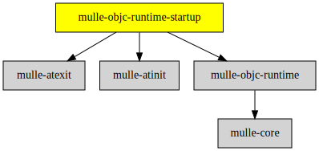

# mulle-objc-runtime-startup

#### ▶️  Startup code for the mulle-objc runtime

This static library provides the required `__register_mulle_objc_universe`
function for executables, that link against
[mulle-objc-runtime](//github.com/mulle-objc/mulle-objc-runtime)
only.

Use this library, if you want to create executables, that only
require the [mulle-objc-runtime](//github.com/mulle-objc/mulle-objc-runtime)
and nothing else. Most projects will link against
[MulleObjC](//github.com/mulle-objc/MulleObjC) or the MulleFoundation
though, and will use the startup libraries.


| Release Version                                       | Release Notes  | AI Documentation
|-------------------------------------------------------|----------------|---------------
|  [](//github.com/mulle-objc/mulle-objc-runtime-startup/actions) | [RELEASENOTES](RELEASENOTES.md) | [DeepWiki for mulle-objc-runtime-startup](https://deepwiki.com/mulle-objc/mulle-objc-runtime-startup)


## Sourcetree

The main raison d'être of mulle-objc-runtime-startup as a seperate library
is to bequeath the required dependencies [mulle-atinit](//github.com/mulle-core/mulle-atinit) and
[mulle-atexit](//github.com/mulle-core/mulle-atexit) for linking with the executable.


### You are here




## Requirements

|   Requirement         | Release Version  | Description
|-----------------------|------------------|---------------
| [mulle-objc-runtime](https://github.com/mulle-objc/mulle-objc-runtime) |  [](https://github.com/mulle-objc/mulle-objc-runtime/actions/workflows/mulle-sde-ci.yml) | ⏩ A fast, portable Objective-C runtime written 100% in C11
| [mulle-atinit](https://github.com/mulle-core/mulle-atinit) |  [](https://github.com/mulle-core/mulle-atinit/actions/workflows/mulle-sde-ci.yml) | 🤱🏼 Compatibility library for deterministic initializers
| [mulle-atexit](https://github.com/mulle-core/mulle-atexit) |  [](https://github.com/mulle-core/mulle-atexit/actions/workflows/mulle-sde-ci.yml) | 👼 Compatibility library to fix atexit


## Add

Use [mulle-sde](//github.com/mulle-sde) to add mulle-objc-runtime-startup to your project.
As long as your sources are using `#include "include-private.h"` and your headers use `#include "include.h"`, there will nothing more to do:

``` sh
mulle-sde add github:mulle-objc/mulle-objc-runtime-startup
```

To only add the sources of mulle-objc-runtime-startup with all the sources of its
dependencies replace "github:" with [clib:](https://github.com/clibs/clib):

## Legacy adds

One common denominator is that you will likely have to add
`#include <mulle-objc-runtime-startup/mulle-objc-runtime-startup.h>` to your source files.


### Add sources to your project with clib

``` sh
clib install --out src/mulle-objc mulle-objc/mulle-objc-runtime-startup
```

Add `-isystem src/mulle-objc` to your `CFLAGS` and compile all the
sources that were downloaded with your project. (In **cmake** add
`include_directories( BEFORE SYSTEM src/mulle-objc)` to your `CMakeLists.txt`
file).


### Add as subproject with cmake and git

``` bash
git submodule add -f --name "mulle-core" \
                            "https://github.com/mulle-core/mulle-core.git" \
                            "stash/mulle-core"
git submodule add -f --name "mulle-atinit" \
                            "https://github.com/mulle-core/mulle-atinit.git" \
                            "stash/mulle-atinit"
git submodule add -f --name "mulle-atexit" \
                            "https://github.com/mulle-core/mulle-atexit.git" \
                            "stash/mulle-atexit"
git submodule add -f --name "mulle-objc-runtime" \
                            "https://github.com/mulle-objc/mulle-objc-runtime.git" \
                            "stash/mulle-objc-runtime"
git submodule add -f --name "mulle-objc-runtime-startup" \
                            "https://github.com/mulle-objc/mulle-objc-runtime-startup" \
                            "stash/mulle-objc-runtime-startup"
git submodule update --init --recursive
```

``` cmake
add_subdirectory( stash/mulle-objc-runtime-startup)
add_subdirectory( stash/mulle-objc-runtime)
add_subdirectory( stash/mulle-atexit)
add_subdirectory( stash/mulle-atinit)
add_subdirectory( stash/mulle-core)

target_link_libraries( ${PROJECT_NAME} PUBLIC mulle-objc-runtime-startup)
target_link_libraries( ${PROJECT_NAME} PUBLIC mulle-objc-runtime)
target_link_libraries( ${PROJECT_NAME} PUBLIC mulle-atexit)
target_link_libraries( ${PROJECT_NAME} PUBLIC mulle-atinit)
target_link_libraries( ${PROJECT_NAME} PUBLIC mulle-core)
```


## Install

Use [mulle-sde](//github.com/mulle-sde) to build and install mulle-objc-runtime-startup and all dependencies:

``` sh
mulle-sde install --prefix /usr/local \
   https://github.com/mulle-objc/mulle-objc-runtime-startup/archive/latest.tar.gz
```

### Legacy Installation


#### Requirements

Install all requirements

| Requirements                                 | Description
|----------------------------------------------|-----------------------
| [mulle-objc-runtime](https://github.com/mulle-objc/mulle-objc-runtime)             | ⏩ A fast, portable Objective-C runtime written 100% in C11
| [mulle-atinit](https://github.com/mulle-core/mulle-atinit)             | 🤱🏼 Compatibility library for deterministic initializers
| [mulle-atexit](https://github.com/mulle-core/mulle-atexit)             | 👼 Compatibility library to fix atexit

#### Download & Install


Download the latest [tar](https://github.com/mulle-objc/mulle-objc-runtime-startup/archive/refs/tags/latest.tar.gz) or [zip](https://github.com/mulle-objc/mulle-objc-runtime-startup/archive/refs/tags/latest.zip) archive and unpack it.

Install **mulle-objc-runtime-startup** into `/usr/local` with [cmake](https://cmake.org):

``` sh
PREFIX_DIR="/usr/local"
cmake -B build                               \
      -DMULLE_SDK_PATH="${PREFIX_DIR}"       \
      -DCMAKE_INSTALL_PREFIX="${PREFIX_DIR}" \
      -DCMAKE_PREFIX_PATH="${PREFIX_DIR}"    \
      -DCMAKE_BUILD_TYPE=Release &&
cmake --build build --config Release &&
cmake --install build --config Release
```


## Author

[Nat!](https://mulle-kybernetik.com/weblog) for Mulle kybernetiK  


